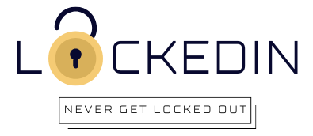

# LockedIn

Overview
The LockedIn App is a secure and convenient website designed to help you save and manage your credentials for different websites. With LockedIn, you no longer need to remember multiple usernames and passwords for various online services. The websites ensures that your sensitive information is encrypted and stored safely, providing you with quick access to your login details whenever you need them. Overall, it provides a reliable and efficient solution for simplifying and securing the process of managing multiple website credentials.

Features
Secure Storage: All your credentials are securely encrypted and stored in the app, ensuring maximum protection against unauthorized access.

Easy-to-Use Interface: The app offers a user-friendly interface, allowing you to quickly add, edit, or delete your login details for different websites.

Quick Access: You can access your saved credentials instantly, so there's no need to go through the hassle of remembering or resetting passwords.

Auto-Lock: To enhance security, the app can be set to auto-lock after a period of inactivity. Additionally, you can enable biometric authentication (fingerprint or face unlock) for added protection.

Getting Started
Account Creation: To get started, visit our website at www.lockedin.com and create a new account. 

Adding Credentials: Log in to your account and use the "Save New Credentials" feature to input the website's URL, your username, and password, along with an optional category.

Managing Credentials: You can edit or delete existing credentials by selecting the respective entry from the app's list view and choosing the desired action.

Security
The Credentials Saver App takes security seriously. Here's how it ensures the safety of your data:

Encryption: Your credentials are encrypted using industry-standard algorithms, ensuring that even if someone gains access to your device, they won't be able to access your sensitive information without the master password.

Local Storage Only: The app stores your encrypted data locally on your device and does not send it to any remote servers, protecting it from potential online threats.

License
The Credentials Saver App is released under the MIT License, allowing you to use, modify, and distribute the software freely.

Credits:
- Vita Fomin - https://github.com/vitafomin
- Peter Gronseth - https://github.com/pg1219
- Daniella Gore - https://github.com/Dani-Gore13
- Arturo Barron - https://github.com/ArturoB10

Repo: https://github.com/pg1219/project-3-password-manager

Deployed Site: 
https://floating-journey-15259-81863c7dc3c2.herokuapp.com/
 